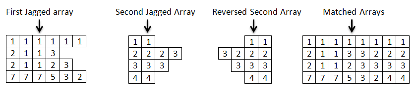

<OL START=14>
	<LI><H2 CLASS="western" STYLE="margin-top: 0in; margin-bottom: 0.08in; line-height: 100%; page-break-before: always">
	Lego Blocks</H2>
</OL>

You
are given two <B>jagged arrays</B>. Each array represents a <B>Lego
block </B>containing integers. Your task is first to <B>reverse</B>
the second jagged array and then check if it would <B>fit perfectly</B>
in the first jagged array. 

The
picture above shows exactly what fitting arrays mean. If the arrays
fit perfectly you should <B>print out</B>
the newly made rectangular matrix. If the arrays do not match (they
do not form a rectangular matrix) you should print out the <B>number
of cells</B> in the first array and in the second
array combined. The examples below should help you understand more
the assignment.

<H3 CLASS="western">Input</H3>

The
first line of the input comes as an <B>integer</B> <B>number n </B>saying
how many rows are there in both arrays. Then you have <B>2 * n</B>
lines of numbers separated by whitespace(s). The first <B>n </B>lines
are the rows of the first jagged array; the next <B>n </B>lines are
the rows of the second jagged array. There might be leading and/or
trailing whitespace(s).

<H3 CLASS="western">Output</H3>

You
should print out the combined matrix in the format: <B>[</B><I><B>elem,
elem, …, elem</B></I><B>] [</B><I><B>elem,
elem, …, elem</B></I><B>] [</B><I><B>elem,
elem, …, elem</B></I><B>]</B><B> </B>If
the two arrays do not fit you should print out : <B>The
total number of cells is: </B><I><B>count</B></I>

<H3 CLASS="western">Constraints</H3>
<UL>
	<LI>

	The number n will be in the range [2…10].

	<LI>

	Time limit: 0.3 sec. Memory limit: 16 MB.

</UL>
<H3 CLASS="western">Examples</H3>
<TABLE WIDTH=690 CELLPADDING=4 CELLSPACING=0>
	<COL WIDTH=492>
	<COL WIDTH=180>
	<TR VALIGN=TOP>
		<TD WIDTH=492 BGCOLOR="#d9d9d9" STYLE="border: 1px solid #00000a; padding-top: 0.04in; padding-bottom: 0.04in; padding-left: 0.06in; padding-right: 0.06in">
			
<B>Input</B>

		</TD>
		<TD WIDTH=180 BGCOLOR="#d9d9d9" STYLE="border: 1px solid #00000a; padding: 0.04in 0.06in">
			
<B>Output</B>

		</TD>
	</TR>
	<TR VALIGN=TOP>
		<TD WIDTH=492 BGCOLOR="#ffffff" STYLE="border: 1px solid #00000a; padding-top: 0.04in; padding-bottom: 0.04in; padding-left: 0.06in; padding-right: 0.06in">
			
2

			
1
			1 1 1 1 1

			
2
			1 1 3

			
1
			1

			
2 2 2 3

		</TD>
		<TD WIDTH=180 BGCOLOR="#ffffff" STYLE="border: 1px solid #00000a; padding: 0.04in 0.06in">
			
[1,
			1, 1, 1, 1, 1, 1, 1]

			
[2,
			1, 1, 3, 3, 2, 2, 2]

		</TD>
	</TR>
	<TR VALIGN=TOP>
		<TD WIDTH=492 BGCOLOR="#ffffff" STYLE="border: 1px solid #00000a; padding-top: 0.04in; padding-bottom: 0.04in; padding-left: 0.06in; padding-right: 0.06in">
			
2

			
1
			1 1 1 1

			
1
			1 1

			
1

			
1 1 1 1 1

		</TD>
		<TD WIDTH=180 BGCOLOR="#ffffff" STYLE="border: 1px solid #00000a; padding: 0.04in 0.06in">
			
The total number
			of cells is: 14

		</TD>
	</TR>
</TABLE>