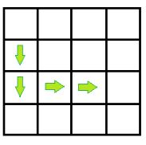

<OL START=18>
	<LI><H2 CLASS="western" STYLE="margin-top: 0in; margin-bottom: 0.08in; line-height: 100%; page-break-before: always">
	** Parking System</H2>
</OL>

The
parking lot in front of SoftUni is one of the busiest in the country,
and it’s a common cause for conflicts between the doorkeeper Bai
Tzetzo and the students. The SoftUni team wants to proactively
resolve all conflicts, so an automated parking system should be
implemented. They are organizing a competition – Parkoniada – and
the author of the best parking system will win a romantic dinner with
RoYaL. That’s <B>exactly</B> what you’ve been dreaming of, so you
decide to join in.

The
parking lot is a <B>rectangular</B> matrix where the <B>first</B>
column is <B>always</B> free and all other cells are parking spots. A
car can enter from any cell of the first column and then decides to
go to a specific spot. If that spot is <B>not </B>free, the car
searches for the <B>closest </B>free spot on the <B>same </B>row. If
<B>all</B> the cells on that specific row are used, the car cannot
park and leaves. If <B>two</B> free cells are located at the <B>same</B>
distance from the <B>initial</B> parking spot, the cell which is
<B>closer</B> to the entrance is preferred. A car can <B>pass </B>through
a used parking spot.

Your
task is to calculate the distance travelled by each car to its
parking spot.

A
car enters the parking at row 1. It wants to go to cell 2, 2 so it
moves through <B>exactly four</B> cells to reach its parking spot.

  

  

<H3 CLASS="western" ALIGN=JUSTIFY STYLE="margin-top: 0in; margin-bottom: 0in">
Input</H3>
<UL>
	<LI>
On the first
	line of input, you are given the integers <B>R</B> and <B>C</B>,
	defining the dimensions of the parking lot.

	<LI>
On the next
	several lines, you are given the integers <B>Z, X,</B> <B>Y</B>
	where <B>Z</B> is the entry row and <B>X, Y</B> are the coordinates
	of the desired parking spot.

	<LI>
The input
	stops with the command ‘<B>stop</B>’. All integers are separated
	by a <B>single</B> space.

</UL>
<H3 CLASS="western" ALIGN=JUSTIFY STYLE="margin-top: 0in; margin-bottom: 0in">
Output</H3>
<UL>
	<LI>
For each
	car, print the distance travelled to the desired spot or the first
	free spot.

	<LI>
If a car
	cannot park on its desired row, print the message ‘<B>Row {row
	number} full</B>’

</UL>
<H3 CLASS="western" ALIGN=JUSTIFY STYLE="margin-top: 0in; margin-bottom: 0in">
Constraints</H3>
<UL>
	<LI>
2 ≤ R,C ≤
	10000

	<LI>
Z, X, Y are
	inside the dimensions of the matrix. Y is never on the first column.

	<LI>
There are no
	more than 1000 input lines

	<LI>
Allowed
	time/space: 0.1s (C#) 0.25s (Java)/16MB

</UL>
<TABLE WIDTH=599 CELLPADDING=4 CELLSPACING=0>
	<COL WIDTH=296>
	<COL WIDTH=285>
	<TR VALIGN=TOP>
		<TD WIDTH=296 BGCOLOR="#d9d9d9" STYLE="border: 1px solid #00000a; padding-top: 0.04in; padding-bottom: 0.04in; padding-left: 0.06in; padding-right: 0.06in">
			
Input

		</TD>
		<TD WIDTH=285 BGCOLOR="#d9d9d9" STYLE="border: 1px solid #00000a; padding-top: 0.04in; padding-bottom: 0.04in; padding-left: 0.06in; padding-right: 0.06in">
			
Output

		</TD>
	</TR>
	<TR VALIGN=TOP>
		<TD WIDTH=296 HEIGHT=80 STYLE="border: 1px solid #00000a; padding-top: 0.04in; padding-bottom: 0.04in; padding-left: 0.06in; padding-right: 0.06in">
			
4
			4

			
1
			2 2

			
2
			2 2

			
2
			2 2

			
3
			2 2

			
stop

		</TD>
		<TD WIDTH=285 STYLE="border: 1px solid #00000a; padding-top: 0.04in; padding-bottom: 0.04in; padding-left: 0.06in; padding-right: 0.06in">
			
4

			
2

			
4

			
Row
			2 full

		</TD>
	</TR>
</TABLE>